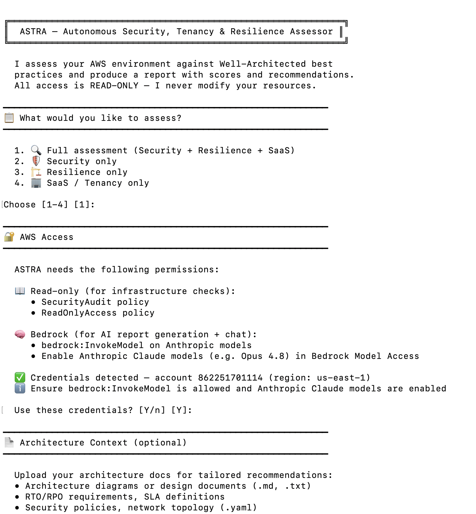
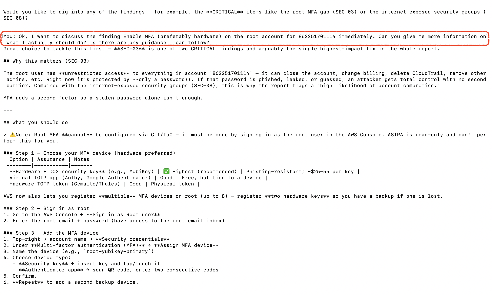
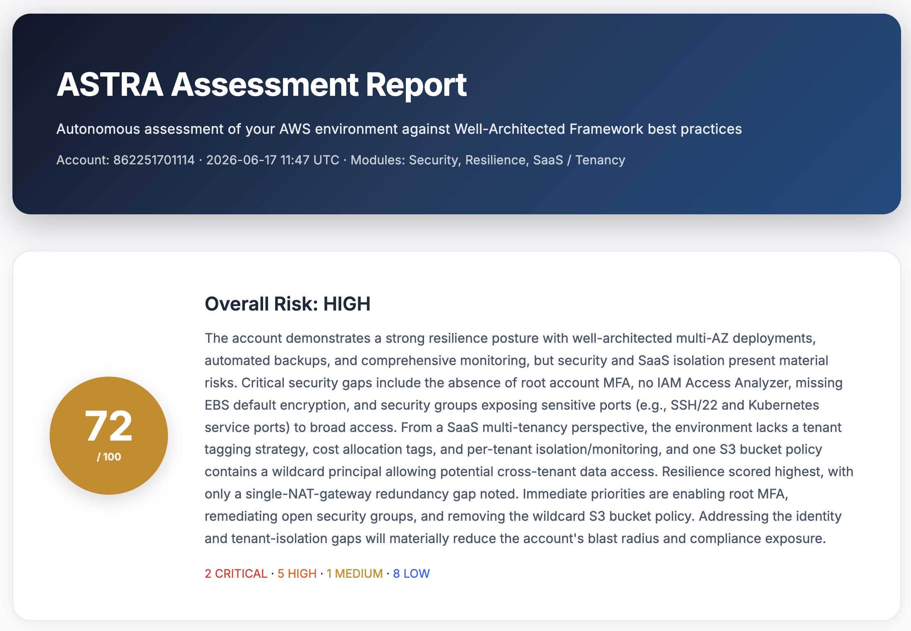
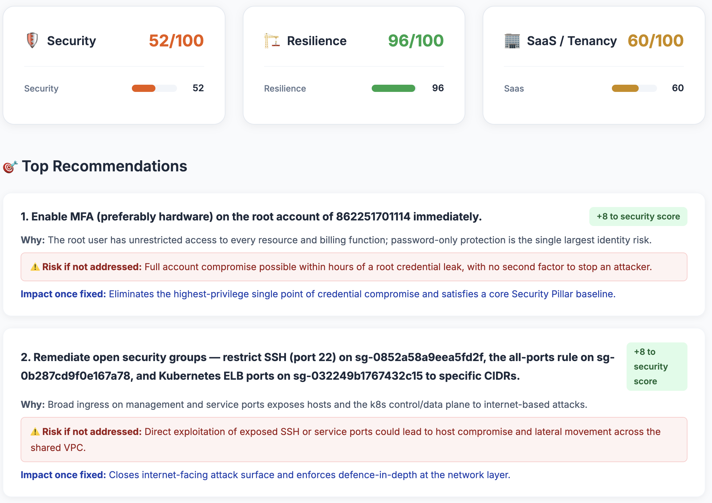
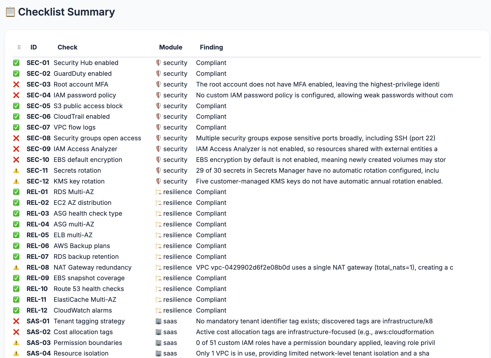
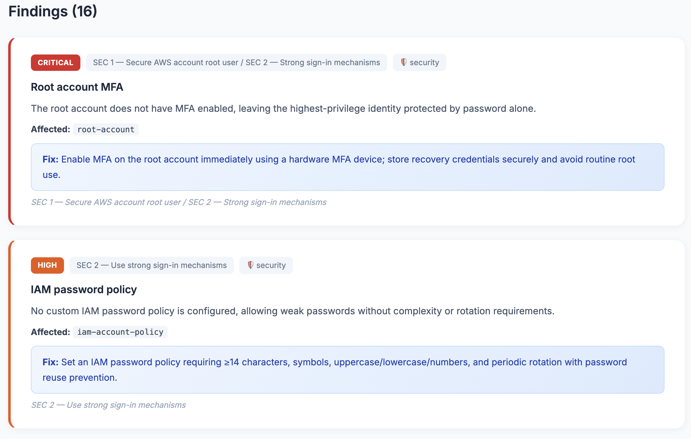

# ASTRA — Autonomous Security, Tenancy & Resilience Assessor

An autonomous AI agent that assesses AWS environments against the **Well-Architected Framework** using read-only access. Runs 34 automated infrastructure checks and — when architecture documentation is provided — covers the full Well-Architected Framework (Security, Reliability, and SaaS pillars). Produces scored reports with actionable recommendations and lets you chat with the agent to explore findings in depth.

---

## Purpose

ASTRA exists to answer one question: **"How well-architected is my AWS environment?"**

It was built for teams that:
- Don't have time for lengthy manual reviews or workshops
- Want a clear benchmark of where they stand
- Need prioritised actions with minimal effort on their side
- Require a repeatable, auditable assessment they can run on schedule

**The pitch:** Grant read-only access, type `astra`, receive a comprehensive assessment. No meetings, no consultants, no disruption.

---

## Capabilities

| What ASTRA Can Do | How |
|-------------------|-----|
| **Assess security posture** | 12 checks: MFA, encryption, network exposure, logging, access control |
| **Evaluate resilience** | 12 checks: Multi-AZ, backups, failover, single points of failure |
| **Audit SaaS architecture** | 10 checks: tenant isolation, cost allocation, noisy neighbour |
| **Score your environment** | 0–100 per module with CRITICAL/HIGH/MEDIUM/LOW risk levels |
| **Discover infrastructure** | Scans VPCs, subnets, instances, databases, load balancers, Lambda, S3 |
| **Generate architecture diagrams** | Visual Mermaid diagram with findings annotated |
| **Produce executive reports** | HTML with scores, checklist table, detailed findings, top recommendations |
| **Tailor recommendations** | Upload your architecture docs — agent compares intent vs reality |
| **Answer follow-up questions** | Interactive chat: "How do I fix SEC-08?" → gets CLI commands, IaC snippets |
| **Run without AI (free)** | `--checks-only` mode for CI/CD pipelines, zero Bedrock cost |
| **Guide non-technical users** | Interactive wizard walks through setup step by step |
| **Auto-detect best model** | Tries Claude Opus 4.8, falls back gracefully if unavailable |

## Limitations

| What ASTRA Cannot Do | Why |
|---------------------|-----|
| **Modify your resources** | Read-only by design — security guarantee |
| **Replace facilitated discussions** | Covers WA questions through automated checks + AI analysis of your docs, but doesn't facilitate team workshops |
| **Assess application logic** | Checks infrastructure configuration, not your code |
| **Scan all regions** | Runs in one region per execution (default: us-east-1) |
| **Remember past assessments** | Each run is independent — no trend tracking yet |
| **Work without Bedrock** | Report generation needs Bedrock (`--checks-only` works without it) |
| **Assess non-AWS environments** | AWS only |

---

## Cost Per Assessment

| Component | Cost | Details |
|-----------|------|---------|
| **AWS API calls** (checks) | $0.00 | Read-only API calls — no charge |
| **Bedrock — report generation** | ~$0.03–0.08 | One LLM call with ~4K input + ~4K output tokens |
| **Bedrock — chat (per question)** | ~$0.01–0.03 | Per follow-up question |
| **`--checks-only` mode** | $0.00 | No Bedrock call at all |
| **Total (typical full run)** | **~$0.05–0.10** | 34 checks + report (+ chat if used) |

**What affects cost:**
- Number of modules assessed (more modules = more findings = larger prompt)
- Amount of customer context loaded (more docs = more input tokens)
- Number of chat questions asked
- Model used (Opus 4.8 costs more than Sonnet 4, but produces better analysis)

---

## What ASTRA Does

```
┌──────────────┐      ┌──────────────────┐      ┌──────────────────┐      ┌─────────────┐
│              │      │                  │      │                  │      │             │
│  34 Checks   │─────▶│  AI Analysis     │─────▶│  Report          │─────▶│  💬 Chat    │
│  (read-only, │      │  (scores, ranks, │      │  (HTML + JSON)   │      │  (discuss   │
│   parallel)  │      │   recommends)    │      │                  │      │   findings) │
│              │      │                  │      │                  │      │             │
└──────────────┘      └──────────────────┘      └──────────────────┘      └─────────────┘
     10-20s                 15-30s                    instant                 interactive
     $0.00                  ~$0.04                    $0.00                   ~$0.01/msg
```

### Capabilities

| Capability | Description |
|-----------|-------------|
| **Assess** | 34 automated checks + full WA Framework coverage with architecture docs |
| **Score** | 0–100 per module, with risk level (CRITICAL/HIGH/MEDIUM/LOW) |
| **Recommend** | Top 5 prioritised actions with WA Framework references |
| **Contextualise** | Upload your architecture docs — agent compares intent vs reality |
| **Chat** | Ask follow-up questions, get CLI commands, IaC snippets, Jira tickets |
| **Automate** | Deploy via CDK for weekly recurring assessments (zero-touch) |

---

## Report Preview

Here's what the assessment report looks like *(click to enlarge)*:

<p>
<a href="docs/screenshots/1.png"></a>
<a href="docs/screenshots/2.png"></a>
</p>
<p>
<a href="docs/screenshots/3.png"></a>
<a href="docs/screenshots/4.png"></a>
</p>
<p>
<a href="docs/screenshots/5.png"></a>
<a href="docs/screenshots/6.png"></a>
</p>

---

## Quick Start

```bash
# Install
git clone https://github.com/Maxim-Kondratyev/astra-agent.git
cd astra-agent && pip install -e .

# Run (interactive guided mode — just type this, the agent guides you)
astra
```

That's it. The agent will:
1. Ask what you want to assess
2. Detect your AWS credentials (or guide you through setup)
3. Optionally load your architecture docs
4. Run all checks and generate a report
5. Offer interactive chat to discuss findings

**For automation (CI/CD or scripts):**

```bash
# Full assessment → HTML report
astra --html report.html

# Security only + customer context
astra -m security -c ./my-docs/ --html report.html --chat

# Quick check without LLM (free, fast, CI/CD friendly)
astra --checks-only -m security -o results.json
```

### Prerequisites

1. **Python 3.11+**
2. **AWS credentials** with read-only access:
   - `arn:aws:iam::aws:policy/SecurityAudit`
   - `arn:aws:iam::aws:policy/ReadOnlyAccess`
3. **Amazon Bedrock** model access enabled (Anthropic Claude models (Opus 4.8 or latest), region: us-east-1)

> 💡 **Don't have credentials configured?** Just run `astra` — it will detect this and guide you through setup step by step with copy-paste commands.

---

## How It Works

### Phase 1: Deterministic Checks (no AI)

34 prebuilt checks run concurrently across 3 modules. Each check makes read-only AWS API calls and returns PASS/FAIL/WARNING with evidence.

| Module | Checks | What It Assesses |
|--------|--------|-----------------|
| 🛡️ Security | 12 | Threat detection, identity, data protection, network, logging |
| 🏗️ Resilience | 12 | Multi-AZ, backups, auto-scaling, failover, single points of failure |
| 🏢 SaaS | 10 | Tenant isolation, cost allocation, noisy neighbour, control plane |

### Phase 2: AI Analysis (Claude via Bedrock)

The LLM receives check results + WA knowledge base + your architecture docs, and produces:
- Scored assessment (0-100 per module)
- Executive summary connecting findings across modules
- Prioritised recommendations tailored to your architecture
- Comparison of your stated goals (RTO/RPO) vs actual infrastructure

### Phase 3: Report & Chat

HTML report with visual score cards, checklist table, and detailed findings. Optionally, drop into interactive chat to discuss findings with the agent.

---

## Interaction Modes

### 📊 Report Mode (default)

```bash
astra --html report.html
```

Produces a styled HTML report with:
- Overall score circle (color-coded)
- Per-module score cards with category breakdowns
- ✅/❌/⚠️ checklist summary table
- Detailed findings with severity, affected resources, and remediation steps
- Top 5 prioritised recommendations

### 💬 Chat Mode

```bash
astra --chat
```

After assessment completes, opens an interactive session where you can ask:

| Question | What You Get |
|----------|-------------|
| "Why did REL-01 fail?" | Detailed explanation with your specific resources |
| "How do I fix it?" | AWS CLI commands, CloudFormation/CDK snippets |
| "What's the business impact?" | Risk assessment based on your architecture |
| "What should I fix first?" | Priority ordering by blast radius and effort |
| "Generate a Jira ticket for the top 3" | Formatted action items ready to paste |
| "Compare my RTO target to actual backup config" | Gap analysis vs your docs |

### ⚡ Checks-Only Mode (CI/CD)

```bash
astra --checks-only -o results.json
```

- Zero LLM calls, zero cost
- Returns structured JSON with all 34 check results
- Exits with code 1 if any FAIL (perfect for CI/CD gates)
- Completes in under 20 seconds

---

## Customer Context

Make recommendations specific to **your** architecture:

```bash
mkdir customer-docs/
# Add:
#   architecture.md     — system overview, component diagram
#   requirements.txt    — RTO/RPO, SLA targets
#   network.yaml        — VPC layout, connectivity
#   security-policy.pdf — compliance requirements
#   design.docx         — design documents

astra -c ./customer-docs/ --html report.html
```

**Supported formats:** `.md`, `.txt`, `.yaml`, `.yml`, `.json`, `.csv`, `.toml`, `.ini`, `.cfg`, `.pdf`*, `.docx`*

*\*PDF and DOCX require: `pip install 'astra-agent[docs]'`*

**💡 Tip:** Have docs in a wiki or website? Save them locally first:
```bash
# From internal wiki/Confluence/SharePoint
curl https://your-wiki.com/architecture > customer-docs/architecture.md

# Or from browser: File → Save As → into your docs folder
```
This keeps the assessment fully offline — no internet access needed, no data leaves your machine.

The agent will then:
- Compare **documented architecture** vs **actual deployed state**
- Validate stated RTO/RPO against backup/failover configuration
- Flag gaps between policy and reality
- Provide recommendations specific to your system

See [`examples/customer-context/`](examples/customer-context/) for a template.

---

## CLI Reference

```
astra [OPTIONS]
```

| Option | Description |
|--------|-------------|
| `-m MODULE` | Module to assess: `security`, `resilience`, `saas`, `all` (repeatable) |
| `-c DIR` | Customer architecture docs folder |
| `--html FILE` | Output styled HTML report |
| `-o FILE` | Output raw JSON report |
| `--chat` | Interactive chat after assessment |
| `--checks-only` | No LLM — raw check results only (CI/CD) |
| `--model ID` | Bedrock model (default: auto-detects best available) |
| `--region` | AWS region for Bedrock (default: us-east-1) |
| `--account-id` | Override account ID (auto-detected) |

---

## Deployment Options

### Option 1: Local CLI (recommended for first run)

```bash
pip install -e .
astra --html report.html
```

### Option 2: Automated (CDK)

```bash
cd infra && pip install -e ".[infra]" && cdk deploy
```

Deploys Lambda + IAM + private VPC + S3 + weekly EventBridge schedule. See [Deployment Guide](docs/DEPLOYMENT.md).

---

## Architecture

```
┌─── Your AWS Account ──────────────────────────────────────────────────────┐
│                                                                             │
│  ┌─────────────────────────────────────────────────────────────────────┐   │
│  │  ASTRA Agent                                                         │   │
│  │                                                                       │   │
│  │  ┌────────────────────────────────────────────────────────────────┐  │   │
│  │  │  Phase 1: CHECKS (concurrent, deterministic)                    │  │   │
│  │  │  ┌──────────┐   ┌──────────────┐   ┌────────────┐             │  │   │
│  │  │  │ Security │   │  Resilience  │   │    SaaS    │             │  │   │
│  │  │  │ 12 checks│   │  12 checks   │   │  10 checks │             │  │   │
│  │  │  └─────┬────┘   └──────┬───────┘   └─────┬──────┘             │  │   │
│  │  │        └────────────────┼─────────────────┘                     │  │   │
│  │  └────────────────────────┬┼──────────────────────────────────────┘  │   │
│  │                           ││                                          │   │
│  │  ┌────────────────────────▼▼──────────────────────────────────────┐  │   │
│  │  │  Phase 2: CONTEXT                                               │  │   │
│  │  │  WA Knowledge Base + Customer Docs (optional)                   │  │   │
│  │  └────────────────────────┬────────────────────────────────────────┘  │   │
│  │                           │                                           │   │
│  │  ┌────────────────────────▼────────────────────────────────────────┐  │   │
│  │  │  Phase 3: AI ANALYSIS (Claude via Bedrock)                │  │   │
│  │  │  → Scores, executive summary, prioritised recommendations       │  │   │
│  │  └────────────────────────┬────────────────────────────────────────┘  │   │
│  │                           │                                           │   │
│  │              ┌────────────┼────────────┐                              │   │
│  │              ▼            ▼            ▼                               │   │
│  │       ┌──────────┐ ┌──────────┐ ┌──────────┐                         │   │
│  │       │  HTML    │ │   JSON   │ │  💬 Chat │                         │   │
│  │       │  Report  │ │  Report  │ │  Session │                         │   │
│  │       └──────────┘ └──────────┘ └──────────┘                         │   │
│  └───────────────────────────────────────────────────────────────────────┘   │
│                                                                             │
│  ┌─────────────────────────────────────────────────────────────────────┐   │
│  │  AWS APIs (read-only via boto3)                                      │   │
│  │  SecurityHub │ GuardDuty │ IAM │ EC2 │ RDS │ ELB │ S3 │ Route53    │   │
│  │  Backup │ CloudTrail │ KMS │ Lambda │ ElastiCache │ CloudWatch      │   │
│  └─────────────────────────────────────────────────────────────────────┘   │
│                                                                             │
│  ┌─────────────────────────────────────────────────────────────────────┐   │
│  │  Amazon Bedrock (via VPC endpoint — no internet)                     │   │
│  │  Claude (best available) → report generation + chat                            │   │
│  └─────────────────────────────────────────────────────────────────────┘   │
└─────────────────────────────────────────────────────────────────────────────┘
```

---

## Security Guarantees

| Layer | Protection |
|-------|-----------|
| IAM Allow | SecurityAudit + ReadOnlyAccess (read operations only) |
| IAM Deny | Explicit deny on ALL create/delete/modify/terminate actions |
| Network | Private VPC with no internet route (CDK deployment) |
| Data | Reports stay in your account. No external transmission. |
| Code | Open source — audit every API call in `src/astra/checklist/` |

---

## Performance

| Metric | Value |
|--------|-------|
| Total checks | 34 |
| Execution (checks) | 10-20s (concurrent) |
| Execution (report) | 15-30s (LLM) |
| Total time | < 60 seconds |
| Cost per run | ~$0.05–0.10 (Bedrock) |
| `--checks-only` | 10-20s, $0.00 |

---

## Documentation

| Document | Contents |
|----------|----------|
| **[Getting Started](docs/GETTING-STARTED.md)** | Prerequisites, setup checklist, common issues |
| **[Deployment Guide](docs/DEPLOYMENT.md)** | CLI + CDK deployment options |
| **[Security Model](docs/SECURITY.md)** | 4-layer read-only enforcement |
| **[Modules & Checks](docs/MODULES.md)** | All 34 checks with WA references |
| **[Architecture](docs/ARCHITECTURE.md)** | E2E flow, components, data model |

---

## Project Structure

```
astra-agent/
├── src/astra/
│   ├── __main__.py          # CLI (argument parsing, output routing)
│   ├── assessment.py        # Runner (concurrent checks → context → LLM)
│   ├── chat.py              # Interactive chat (multi-turn conversation)
│   ├── interactive.py       # Guided onboarding wizard
│   ├── models.py            # Auto-detect best available Bedrock model
│   ├── preflight.py         # Pre-run validation (creds, permissions)
│   ├── discovery.py         # Infrastructure topology scanner
│   ├── diagram.py           # Mermaid architecture diagram generator
│   ├── checklist/
│   │   ├── __init__.py      # CheckResult, Status (shared types)
│   │   ├── security.py      # 12 Security Pillar checks
│   │   ├── resilience.py    # 12 Reliability Pillar checks
│   │   └── saas.py          # 10 SaaS Lens checks
│   ├── report/
│   │   └── generator.py     # JSON → styled HTML report
│   └── knowledge/           # WA best practice reference (LLM context)
├── infra/                   # CDK stack (Lambda + VPC + IAM + S3)
├── docs/                    # GETTING-STARTED, DEPLOYMENT, SECURITY, MODULES, ARCHITECTURE
├── examples/
│   └── customer-context/    # Sample architecture doc template
├── tests/                   # 65 tests (moto-mocked AWS)
├── specs/                   # Original requirements & design
└── pyproject.toml           # Python package config
```

## Tech Stack

| Component | Technology | Purpose |
|-----------|-----------|---------|
| Agent Framework | [Strands Agents SDK](https://github.com/strands-agents/sdk-python) | LLM orchestration + multi-turn chat |
| Foundation Model | Claude (Amazon Bedrock) — auto-detects best available | Report synthesis + interactive Q&A |
| Infrastructure | AWS CDK (Python) | One-command customer deployment |
| Checks | boto3 | Read-only AWS API calls |
| Concurrency | ThreadPoolExecutor | 3 modules in parallel |
| Report | HTML + inline CSS | Zero-dependency visual output |
