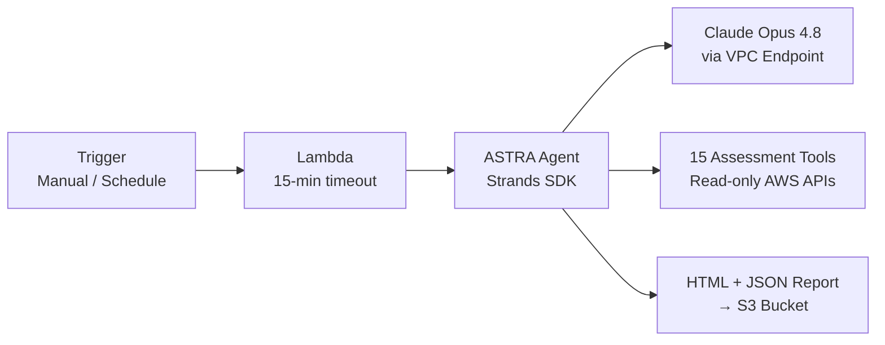

# ASTRA

**Autonomous Security, Tenancy & Resilience Assessor**

An AI-powered agent that autonomously assesses AWS environments against security, resilience, and SaaS/tenancy best practices — using **read-only access only**.

[]()
[]()
[]()
[]()

---

## What ASTRA Does

ASTRA deploys into a customer's AWS account, calls 15 read-only assessment tools across 3 modules, and produces a scored report with prioritised remediation recommendations.

```
┌──────────────────────────────────────────────────────────────┐
│  ASTRA Agent (Claude Opus 4.8)                               │
│                                                              │
│  ┌──────────────┐  ┌──────────────┐  ┌──────────────┐      │
│  │  🛡️ Security  │  │  🏗️ Resilience│  │  🏢 SaaS      │      │
│  │  5 tools     │  │  5 tools     │  │  5 tools     │      │
│  └──────────────┘  └──────────────┘  └──────────────┘      │
│                                                              │
│  ────────────────── READ-ONLY ONLY ──────────────────────── │
└──────────────────────────────────────────────────────────────┘
         │                                        │
         ▼                                        ▼
  AWS APIs (read)                         HTML Report (write to S3)
```

### Output Example

| Metric | Value |
|--------|-------|
| Overall Score | 31/100 |
| Risk Level | CRITICAL |
| Findings | 18 prioritised |
| Categories | Identity, Network, Data, Infrastructure, Logging |
| Run Time | ~3 minutes |
| Cost | ~$3-5 per run (Opus) or ~$0.50 (Sonnet) |

---

## Quick Start

```bash
pip install -e .
python -m astra --html report.html
open report.html
```

See [Deployment Guide](docs/DEPLOYMENT.md) for full instructions.

---

## Modules

| Module | Checks | WA Pillar |
|--------|--------|-----------|
| 🛡️ **Security** | Security Hub, GuardDuty, IAM, S3, Encryption | Security |
| 🏗️ **Resilience** | Multi-AZ, Backups, Auto-Scaling, Failover, SPOF | Reliability |
| 🏢 **SaaS/Tenancy** | Isolation, Tagging, Control Plane, Cost, Observability | SaaS Lens |

Run individual modules:
```bash
python -m astra --module security
python -m astra --module resilience
python -m astra --module saas
```

See [Modules Guide](docs/MODULES.md) for details on all 15 tools.

---

## Security Guarantees

ASTRA enforces read-only access through **4 layers of defence**:

1. **IAM Managed Policies** — SecurityAudit + ReadOnlyAccess (no write permissions)
2. **Explicit DENY** — Blocks Create/Delete/Modify/Update/Terminate on all resources
3. **Code-Level** — Only `describe_*`, `list_*`, `get_*` boto3 calls in the codebase
4. **Network** — VPC endpoints only, no internet egress

See [Security Model](docs/SECURITY.md) for the full threat model and CISO talking points.

---

## Architecture



See [Architecture](docs/ARCHITECTURE.md) for full diagrams (Mermaid), data flows, and technology choices.

---

## Deployment to Customer Accounts

```bash
cd infra
cdk deploy
# → Creates: IAM role, Lambda, S3 bucket, VPC with endpoints
# → No internet access, no data leaves the account
```

See [Deployment Guide](docs/DEPLOYMENT.md) for CDK parameters, scheduling, and customer checklist.

---

## Documentation

| Document | Contents |
|----------|----------|
| [Architecture](docs/ARCHITECTURE.md) | System design, Mermaid diagrams, technology choices |
| [Deployment](docs/DEPLOYMENT.md) | CLI quick start, CDK production deployment, cost estimates |
| [Security](docs/SECURITY.md) | 4-layer defence-in-depth, threat model, verification commands |
| [Modules](docs/MODULES.md) | All 15 tools, scoring methodology, custom module guide |

---

## Technology Stack

| Component | Technology |
|-----------|-----------|
| Agent Framework | [Strands Agents SDK](https://github.com/strands-agents/sdk-python) |
| Foundation Model | Claude Opus 4.8 (Amazon Bedrock) |
| Compute | AWS Lambda (serverless, 15-min timeout) |
| Deployment | AWS CDK (Python) |
| Networking | VPC Endpoints (zero internet) |
| Storage | S3 (encrypted, no public access) |
| IAM | SecurityAudit + ReadOnlyAccess + Explicit DENY |

---

## Project Structure

```
astra-agent/
├── src/astra/
│   ├── agent.py                 # Agent definition (model, tools, prompt)
│   ├── __main__.py              # CLI entrypoint
│   ├── tools/
│   │   ├── security.py          # 5 security tools
│   │   ├── resilience.py        # 5 resilience tools
│   │   └── saas.py              # 5 SaaS/tenancy tools
│   └── report/
│       └── generator.py         # JSON → styled HTML report
├── infra/
│   ├── stacks/astra_stack.py    # CDK stack (VPC, IAM, Lambda, S3)
│   └── lambda/handler.py        # Lambda handler
├── docs/                        # Architecture, deployment, security, modules
├── specs/                       # Requirements, design, context
└── pyproject.toml
```

---

## Status

✅ **All 3 modules implemented and tested**  
✅ **15 assessment tools (all read-only)**  
✅ **CDK stack with VPC endpoints + EventBridge schedule**  
✅ **HTML report generator with multi-module scoring**  
✅ **Comprehensive documentation**

---

## License

Internal — EMEA-ISV TAM team. Contact the author for access.
