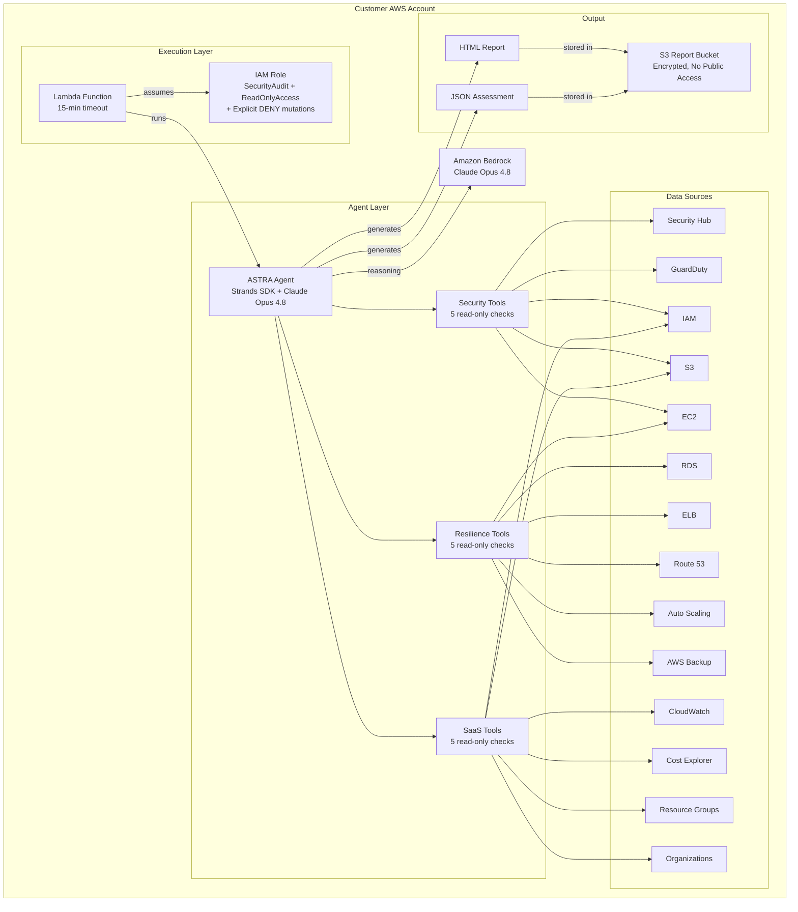
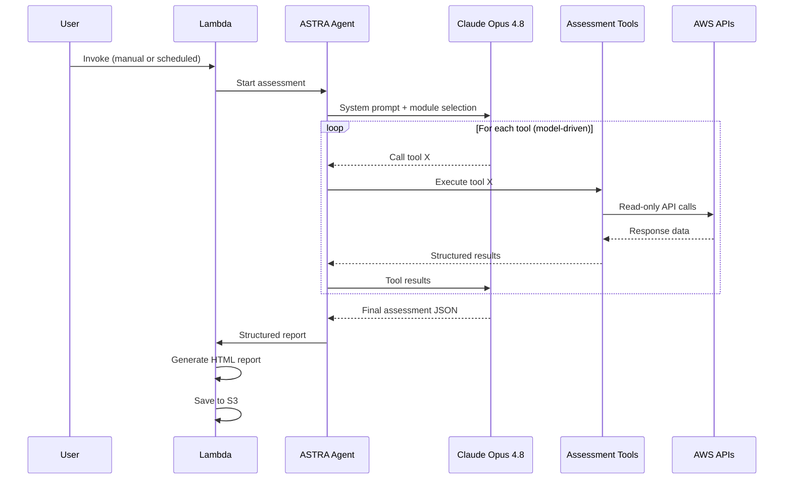
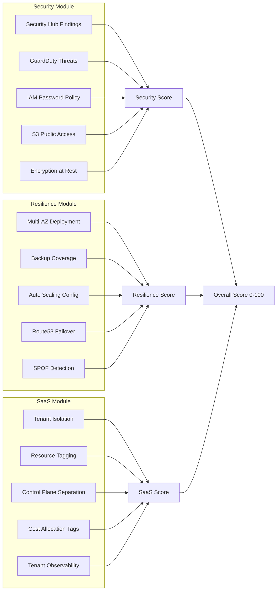
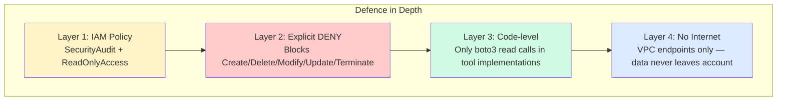
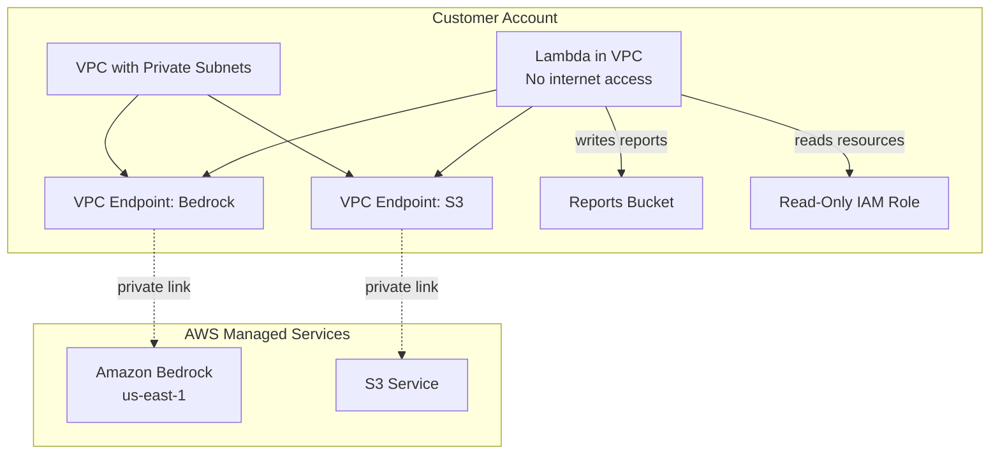
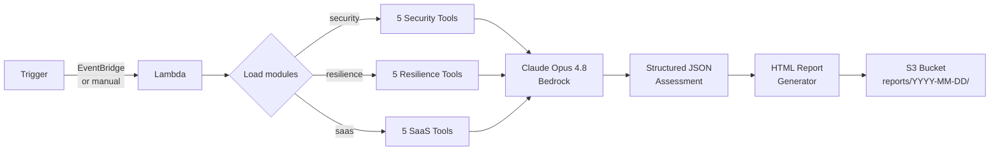

# ASTRA Architecture

## Overview

ASTRA is a **model-driven autonomous agent** that uses Claude Opus 4.8 (via Amazon Bedrock) to orchestrate read-only AWS API calls, analyse the results against best practices, and produce a scored assessment report.

The architecture follows the **agent-as-a-service** pattern: the agent runs inside the customer's AWS account, never sends data externally, and operates exclusively with read-only permissions.

## High-Level Architecture

## Agent Decision Flow

## Module Architecture

## Security Model

## Deployment Topology

## Data Flow

## Technology Choices

| Component | Technology | Rationale |
|-----------|-----------|-----------|
| Agent Framework | Strands Agents SDK | AWS-native, model-driven, minimal orchestration code |
| Foundation Model | Claude Opus 4.8 | Most capable reasoning for complex multi-service analysis |
| Compute | AWS Lambda | Serverless, no idle cost, 15-min sufficient for all modules |
| Deployment | AWS CDK (Python) | One-command deployment, parameterisable, reproducible |
| Storage | S3 (encrypted) | Customer-owned, no data leaves the account |
| Networking | VPC Endpoints | Zero internet egress, full data sovereignty |
| IAM | SecurityAudit + DENY policy | Defence-in-depth read-only enforcement |

## Scaling Considerations

| Dimension | Current Limit | Mitigation |
|-----------|--------------|------------|
| Lambda timeout | 15 minutes | Sufficient for 500+ resources across 3 modules |
| Bedrock throttling | Account-level quotas | Sequential tool calls (not parallel) to stay within limits |
| S3 bucket listing | 1000 objects per page | Paginated queries, sample up to 20 for efficiency |
| Multi-account | Single account per run | Organizations support planned (Phase 2) |
| Cost per run | ~$3-5 (Opus 4.8 tokens) | Can switch to Sonnet 4.6 for $0.50-1.00 per run |
